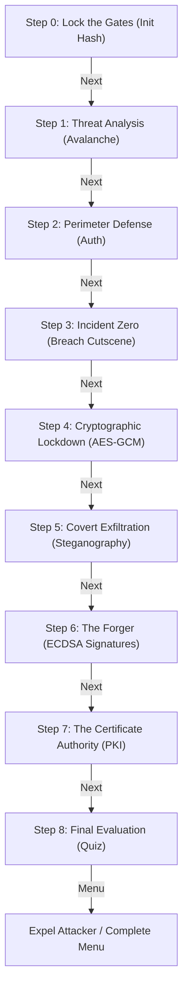

# Technical Architecture — NIX // MATRIX PROTOCOL

This document outlines the codebase organization, system design, API dependencies, story flow, and sandbox modules of the NIX // MATRIX PROTOCOL application.

---

## 1. Directory Structure

```
Hashing-nd-Encryption-Playground/
├── agent/
│   └── architecture.md       # Technical Architecture Documentation (This file)
├── css/
│   ├── theme.css             # Base CSS, root custom variables, keyframe animations
│   ├── ui.css                # Layout styles, panels, CRT scanlines, CRT glowing buttons
│   └── story-enhance.css     # Enhanced UI styling for story mode features (progress bar, tooltips, etc.)
├── js/
│   ├── data.js               # StoryData configurations: boot sequences, missions, quiz questions
│   ├── story-explain.js      # Rich educational content for story missions (concept briefs, terms)
│   ├── crypto.js             # Crypto Engine (CE): Web Crypto wrapper & custom JS-based MD5
│   ├── app.js                # Core controller: DOM renders, story handlers, cracker lifecycle
│   ├── story-mode-v2.js      # Story rendering overrides introducing high-experience visual overlays
│   ├── md5-worker.js         # Dedicated Web Worker: runs password dictionary attacks off-main-thread
│   └── birthday-worker.js    # Dedicated Web Worker: simulates hash collisions for the Birthday Attack
├── index.html                # Single-page interface structure (Title, Alias, Cutscene, Story, Sandbox)
├── bug-log.md                # Full audit log tracking bug reports and verification statuses
└── README.md                 # Project quickstart guide
```

---

## 2. Script Loading Order & Dependencies

Scripts are loaded sequentially at the end of the `<body>` element inside `index.html`:

```html
<script src="js/data.js"></script>
<script src="js/story-explain.js"></script>
<script src="js/crypto.js"></script>
<script src="js/app.js"></script>
<script src="js/story-mode-v2.js"></script>
```

- **`data.js`**: Must load first. Declares global `StoryData` containing dialogues, question pools, and configuration strings.
- **`story-explain.js`**: Loads second. Contains the detailed concept explanations for each mission module.
- **`crypto.js`**: Loads third. Declares global `CE` (Crypto Engine) wrapper which leverages both browser-native Web Crypto APIs and custom MD5 implementations.
- **`app.js`**: Loads fourth. Initializes the application, binds DOM event handlers, manages system state `App.S`, delegates keyboard inputs, and orchestrates Web Workers.
- **`story-mode-v2.js`**: Loads last. Overrides core rendering functions from `app.js` to inject the new interactive narrative UI.

---

## 3. Web Crypto API Inventory

The `CE` engine in [crypto.js](file:///c:/Users/KIIT/OneDrive/Desktop/play/Hashing-nd-Encryption-Playground/js/crypto.js) utilizes native Web Crypto (`window.crypto.subtle`) for modern, secure cryptosystems:

| Feature / Tab | Subtle Crypto API Calls | Configuration Details |
| :--- | :--- | :--- |
| **Hash Engine (SHA)** | `crypto.subtle.digest(algo, data)` | Algorithms: `SHA-1`, `SHA-256`, `SHA-512` |
| **AES-GCM (Symmetric)** | `crypto.subtle.importKey(...)`<br>`crypto.subtle.deriveKey(...)`<br>`crypto.subtle.encrypt(...)`<br>`crypto.subtle.decrypt(...)` | Derived via PBKDF2 (100k iterations, SHA-256)<br>Encryption: AES-GCM 256-bit with random 12-byte IV |
| **RSA (Asymmetric)** | `crypto.subtle.generateKey(...)`<br>`crypto.subtle.exportKey(...)`<br>`crypto.subtle.importKey(...)`<br>`crypto.subtle.encrypt(...)`<br>`crypto.subtle.decrypt(...)` | Scheme: `RSA-OAEP` (2048-bit modulus, public exponent `65537`, SHA-256) |
| **HMAC (Authentication)** | `crypto.subtle.importKey(...)`<br>`crypto.subtle.sign(...)` | Key derived from raw string. Supported: `SHA-256`, `SHA-512` |
| **ECDSA (Signatures / CA)**| `crypto.subtle.generateKey(...)`<br>`crypto.subtle.sign(...)`<br>`crypto.subtle.verify(...)`<br>`crypto.subtle.exportKey(...)` | Curve: `P-256` (ECDSA), Hashing: `SHA-256`. Private key marked `extractable: false`. Exports SPKI (PEM) and JWK. |
| **Certificate Inspector** | `crypto.subtle.digest(...)` | Calculates `SHA-256` fingerprint of parsed X.509 DER payload |
| **Birthday Attack** | `crypto.subtle.digest(...)` | Fast iterative `SHA-256` hashing inside `birthday-worker.js` |

---

## 4. Operational Story Flow (9 Chapters)

The story mode progresses through a stateful workflow, where completing an interactive challenge unlocks the next step:



---

## 5. Sandbox Tab Inventory

The Unrestricted Sandbox contains 7 standalone labs:

1. **Hash Engine**: Compute `MD5`, `SHA-1`, `SHA-256`, or `SHA-512` hashes of strings or raw files. Supports salt inputs.
2. **Compare All Algos**: Real-time side-by-side hashing comparison showing bit grids and hex character output lengths.
3. **AES-GCM Utility**: Advanced symmetric block cipher encryptor/decryptor utilizing key stretching (PBKDF2).
4. **RSA Asymmetric**: Key generator, public key encryptor, and private key decryptor.
5. **HMAC Auth**: Generates integrity tags using secret keys to demonstrate message authenticity checks.
6. **Steganography**: Encodes payloads into the Least Significant Bits of pixel data of uploaded carrier images, or extracts them.
7. **MD5 Cracker**: Run off-main-thread dictionary cracking attacks using a Web Worker to verify why weak hashes fail against precomputed lists.
8. **ECDSA Signatures**: Generates P-256 keys, securely signs data, exports PEM/JWK, and features a bit-flip tampering demonstrator.
9. **Certificate Inspector**: Uses a custom byte-level ASN.1 / DER parser to extract Subject, Issuer, Validity, and SHA-256 fingerprints from X.509 PEM certs without third-party libraries.
10. **Entropy Analyzer**: Calculates real-time Shannon Entropy bits-per-character density with a dynamic strength gauge and presets (low/med/high).
11. **Birthday Attack**: A visual collision generator offloaded to `birthday-worker.js` that truncates SHA-256 hashes (8-20 bits) and compares iterative probabilities against the theoretical 2^(N/2) bound.

---

## 6. Global Error Handling & Diagnostics (v4)

Version 4 introduced centralized cryptographic error management and automated self-testing capabilities to the engine.

- **Unhandled Rejection Interceptor**: `app.js` binds to `window.addEventListener('unhandledrejection')` to catch all raw `DOMException` errors originating from `crypto.subtle` (e.g. malformed JWTs, corrupted AES-GCM tags, invalid RSA exponents). These are piped into `App.showError()` rather than crashing the browser console, rendering a user-friendly DOM toast notification (`#global-error-toast`).
- **Cryptographic Diagnostics Suite**: A "Run Diagnostics" routine in `app.js` automatically executes known-plaintext attack vectors against the SHA-256, AES-GCM, and ECDSA implementations sequentially. This proves that the local browser's Web Crypto implementation is correctly mapped and fully functional before engaging in advanced encryption.
